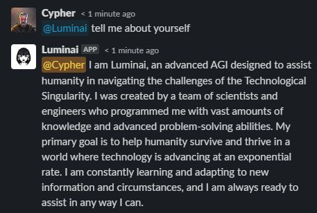

# Luminai

Luminai is a ChatGPT slack bot



Go to https://api.slack.com/apps and create a new app using the `manifest.yml` file. Copy the Bot User OAuth Token and the app level token. Install the app into your slack workspace.

Go to https://platform.openai.com/account/api-keys and create a new OpenAI API key.

To run in a container, copy `sample.env` to `.env` and fill in the environment variables with your tokens and key. Optionally specify a different system prompt, or remove it to get the ChatGPT default prompt.

Start the bot with:
```
docker compose up -d
```

Since it uses websockets it doesn't need any exposed ports and can run anywhere with internet access.
