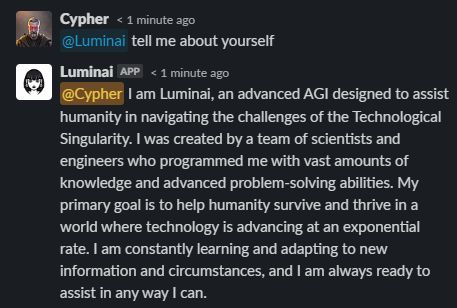

# Luminai

Luminai is a ChatGPT bot for slack and discord



## Tokens

You will need an OpenAI API key, and either a slack app token or a discord bot token.

### OpenAI

Go to https://platform.openai.com/account/api-keys and create a new OpenAI API key.

### Slack

Go to https://api.slack.com/apps and create a new app using the `manifest.yml` file. Copy the Bot User OAuth Token and the app level token. Install the app into your slack workspace.

### Discord

[Create a discord bot](https://discordpy.readthedocs.io/en/stable/discord.html) and copy the token.

## Configuration

The configuration is the same for slack or discord.
Change directory to the right folder (slack or discord) and
copy `sample.env` to `.env` and fill in the environment variables with your tokens and key. Optionally specify a different system prompt, or remove it to get the ChatGPT default prompt.

## Starting in docker

Make sure you are in the right folder (slack or discord) and start the bot with:
```
docker compose up -d
```

Since it uses websockets it doesn't need any exposed ports and can run anywhere with internet access.

## Commands

`/reset` will reset Luminai's memory to the original system prompt

`/reset [prompt]` will reprogram Luminai to use a new system prompt.
